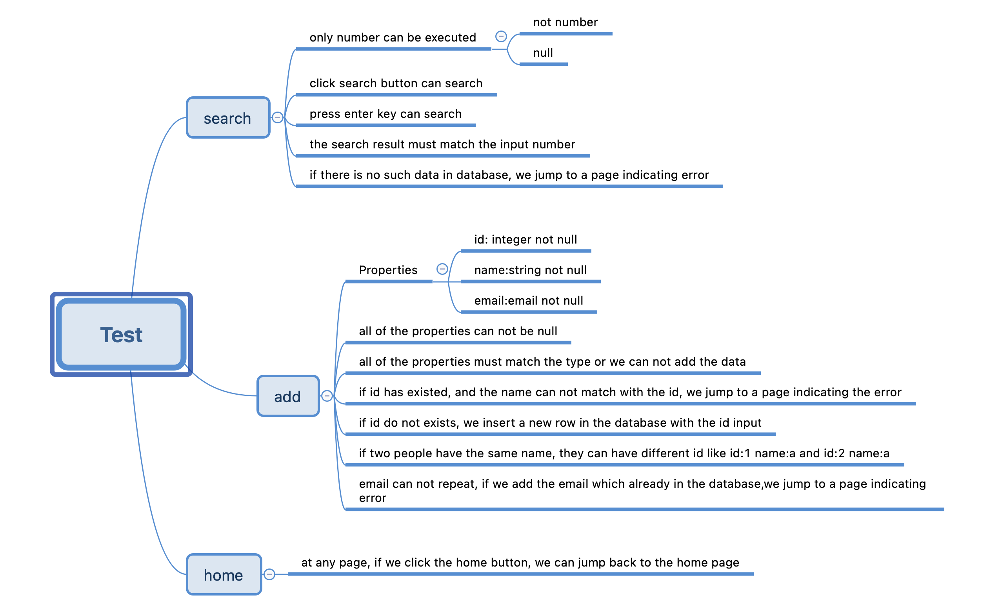
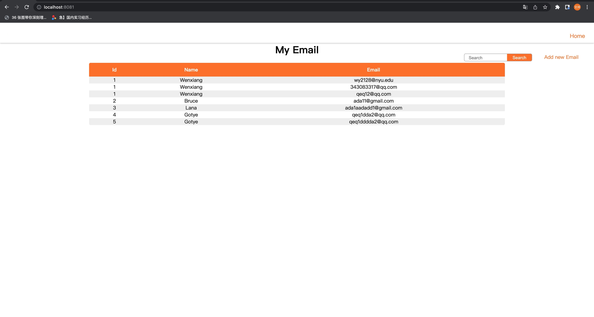
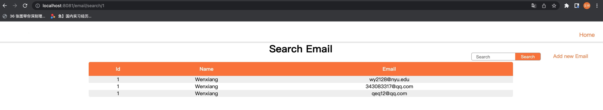
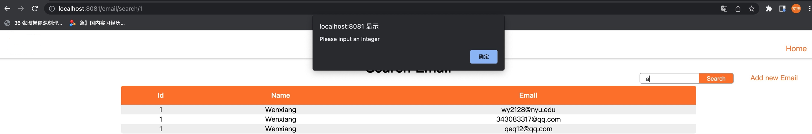
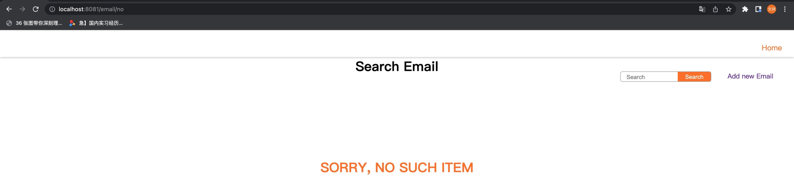

# Realize add email and search email with Laminas

## Task
>App that has two routes:
> + /email/add to add data to database 
> >- This is an HTML page with inputs on submit, data should be written to database if valid  
> >- On submit, data should be written to database if valid
> + /email/add to add data to database
> >- /email/add/{id} to retrieve data from database  
> >- This is an HTML page

## Data

> The data we can store includes names, email addresses and uid. Each user can store many mailboxes.

## Logic
>+ to add data to database
> >- We can add data to database with uid, name and email.  
> >- On submit, data should be written to database if valid.  
> >- If email has been exited in database, we should not save this data, and redirect to an error page.  
> >- If the uid has existed and the name we type can not match the name searching by the uid, we redirect to an error page.
>+ retrieve data from database
> >- When we type a number in search bar, we can redirect to a page with the data we want.  
> >- This is an HTML page.

##Test
>Here are test cases
> 
>+ Frontend  
> >- Each page can render the correct data.  
> > 
> > 
> >- When we search the data, only Integer more than 0 can be executed. If we type other type of data like a letter, the page would alert us type an Integer.
> > 
> > If we can not find the data by the number we type, it will inform no such item.  
> > 
> >- When we add data to the database, the uid, name and email must follow the rules, otherwise it will alert us to input the correct data.
> + Backend  
> >- Please see the test package. 